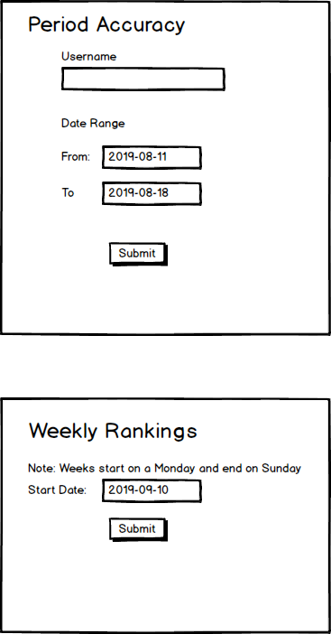

## Create a minimal Rails app configured to use MySQL with these models:

* User:
  - username
  - timezone
  - created_at

* Answer:
  - user_id
  - correct
  - created_at

Both of these have model and migration placeholders. You may add more
tables and columns as needed.

## A. Populate the data

Write a rake task to populate the DB with 100,000 users randomly
distributed across time zones in US, Europe and Asia. For each user,
generate 1,000 answers. The answer records should have the “created_at”
timestamps distributed over the last 6 months, and be randomly
“correct”.

A stub is available for rake data:populate in lib/tasks/data.rake

This populated data is then used for tasks B) and C) below.

## B. Period Accuracy 

Create a form which takes as input:
a) username
b) date range 
    From: 2019-08-11
    To:   2019-08-18

Output a page reporting the following information __based on the timezone
of the specified username__. This timezone would have been randomly
assigned to the user earlier, as part of the data population task above.

1. The overall accuracy (% correct) for the user 
2. The accuracy (% correct) for the user within the specified date range.

## C. Weekly Rankings

Create a form which takes as input, a week.

You can make certain assumptions to make input simpler and compute data
efficiently:

* Week starts on a Monday and ends on Sunday.
* Timezone is UTC

Output a page ranking the top 100 users for the specified week. Ranking
is based on accuracy (% correct) for the week. For each user listed,
include the following columns:

1. username
2. Rank this week
3. Change from previous week, e.g. +2, -12

## Form Mockups

Please see `task-forms.png` for very rudimentary mockups illustrating
form input.

## Styling

Our emphasis on evaluating the logic, but we have included Bootstrap
base styling if you want to make the reports more presentable.

## General Instructions

0. Please publish the code to your public git repository and send us the link.
1. Update the README with instructions for running the app locally.
2. Note other assumptions, if any, that you have made.
3. List any enhancements you could make if you had more time.

